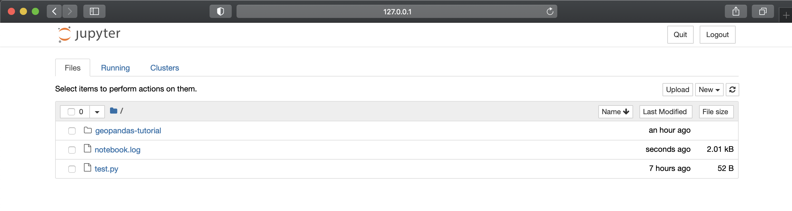
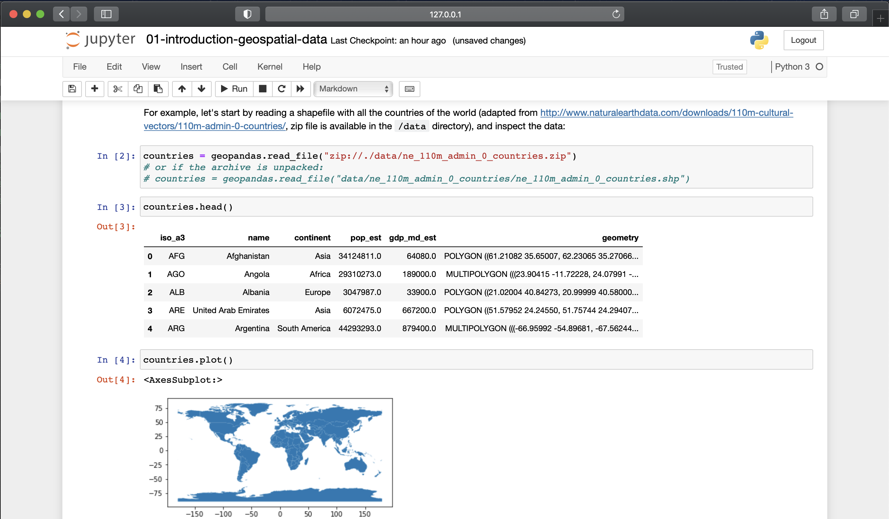

# Overview
This will help you to setup a python environment to play with GIS data using geopandas

# Setup env

- Install Docker

[Follow this instructions for your OS](https://docs.docker.com/get-docker/)

- Clone this repo

```
$ git clone git@github.com:edgar-mercado/docker_geo_womeat.git
```

or

```
$ git clone https://github.com/edgar-mercado/docker_geo_womeat.git

```

- Change directory

```
$ cd docker_geo_womeat
```

- Run the container and access into it

```
$ docker run -it -v $(pwd)/app:/app -p 8888:8888 ecme820721/womeat:latest bash
```

- Start Jupyter in background

```
$ nohup jupyter notebook --port=8888 --no-browser --ip=0.0.0.0 --allow-root > notebook.log &
[1] 8
# nohup: ignoring input and redirecting stderr to stdout
```

- Hit enter and run the following command to get the URL and token

```
$ cat notebook.log | grep "127.0.0.1"
http://127.0.0.1:8888/?token=ea0245bce953c7dfe9e35dxxxxxxxxxe27f614ca638023
```

- Open the URL in your browser



