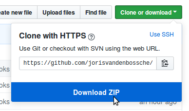

# Introduction to geospatial data analysis with GeoPandas and the PyData stack

[](https://mybinder.org/v2/gh/jorisvandenbossche/geopandas-tutorial/master)

## Tutorial on geospatial data manipulation with Python

This tutorial is an introduction to geospatial data analysis in Python, with a focus on tabular vector data using GeoPandas. 
It will introduce the different libraries to work with geospatial data and will cover munging geo-data and exploring relations over space. This includes importing data in different formats (e.g. shapefile, GeoJSON), visualizing, combining and tidying them up for analysis, exploring spatial relationships, ... and will use libraries such as pandas, geopandas, shapely, pyproj, matplotlib, cartopy, ... 
 
The tutorial will cover the following topics, each of them using Jupyter notebooks and hands-on exercises with real-world data:

1. Introduction to vector data and GeoPandas
2. Visualizing geospatial data
3. Spatial relationships and operations
4. Spatial joins and overlays
5. Short showcase of parallel/distributed geospatial analysis with Dask

This repository initially contained the teaching material for the geospatial data analysis tutorial
at [GeoPython 2018](http://2018.geopython.net), May 7-9 2018, Basel, Switzerland, and was later updated and also
used at [Scipy 2018](https://scipy2018.scipy.org/), [EuroScipy 2018](https://www.euroscipy.org/2018/), [GeoPython 2019](http://2019.geopython.net), [EuroScipy 2019](https://www.euroscipy.org/2019/).


## Installation notes

Following this tutorial will require recent installations of:

- Python >= 3.5
- pandas
- geopandas >= 0.5.0
- matplotlib
- rtree
- mapclassify
- contextily
- [Jupyter Notebook or Lab](http://jupyter.org)
- *(optional for mining sites case study)* rasterio, rasterstats
- *(optional for visualisation showcase)* cartopy, geoplot, folium, ipyleaflet

If you do not yet have these packages installed, we recommend to use the [conda](http://conda.pydata.org/docs/intro.html) package manager to install all the requirements 
(you can install [miniconda](http://conda.pydata.org/miniconda.html) or install the (larger) Anaconda
distribution, found at https://www.anaconda.com/download/).

Using conda, we recommend to create a new environment with all packages using the
following commands:

```bash
# ensure you have at least conda >=4.6
conda update conda
# setting the configuation so all packages come from the conda-forge channel
conda config --add channels conda-forge
conda config --set channel_priority strict
# navigate to the downloaded (or git cloned) material
cd .../geopandas-tutorial/
# creating the environment
conda env create --name geo-tutorial --file environment.yml
# activating the environment
conda activate geo-tutorial
```

For this, you need to already download the materials first (see below), as it
makes use of the `environment.yml` file included in this repo.

Alternatively, you can install the packages using conda manually, or you can use
another distribution (e.g. Enthought Canopy) or ``pip``, as long as you have
the above packages installed. In that case, we refer to the installation instructions
of the individual packages.

**Want to try out without installing anything?** You can use the "launch binder" link above at the top of this README, which will launch a notebook instance on Binder with all required libraries installed.


## Downloading the tutorial materials

**Note**: *I am still updating the materials, so I recommend to only download the materials the morning before the tutorial starts, or to update your local copy then. To update a local copy, you can download the latest version again, or do a `git pull` if you are using git.*

If you have git installed, you can get the tutorial materials by cloning this repo:

    git clone https://github.com/jorisvandenbossche/geopandas-tutorial.git

Otherwise, you can download the repository as a .zip file by heading over
to the GitHub repository (https://github.com/jorisvandenbossche/geopandas-tutorial) in
your browser and click the green "Download" button in the upper right:




## Test the tutorial environment

To make sure everything was installed correctly, open a terminal, and change its directory (`cd`) so that your working directory is the tutorial materials you downloaded in the step above. Then enter the following:

```sh
python check_environment.py
```

Make sure that this scripts prints "All good. Enjoy the tutorial!"

